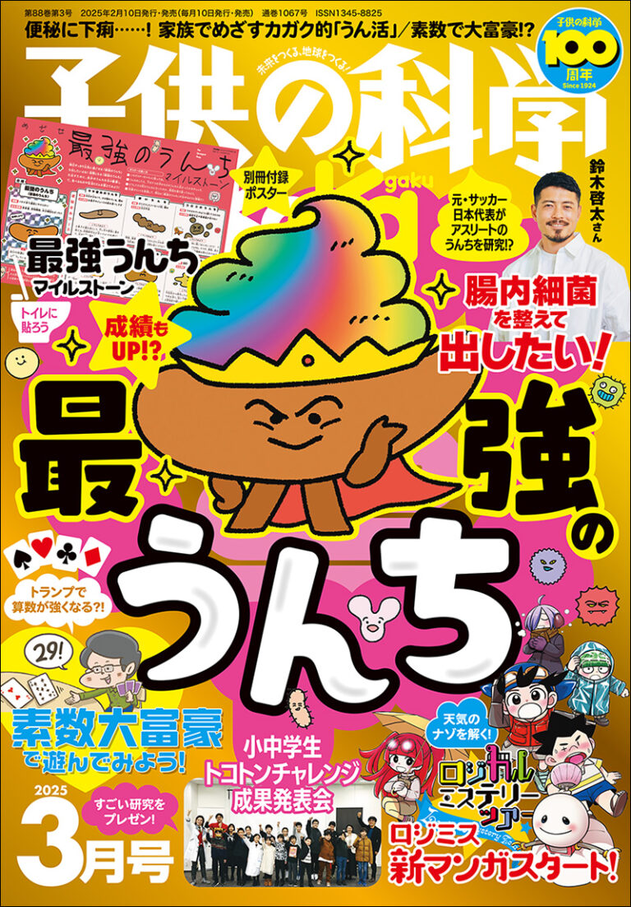
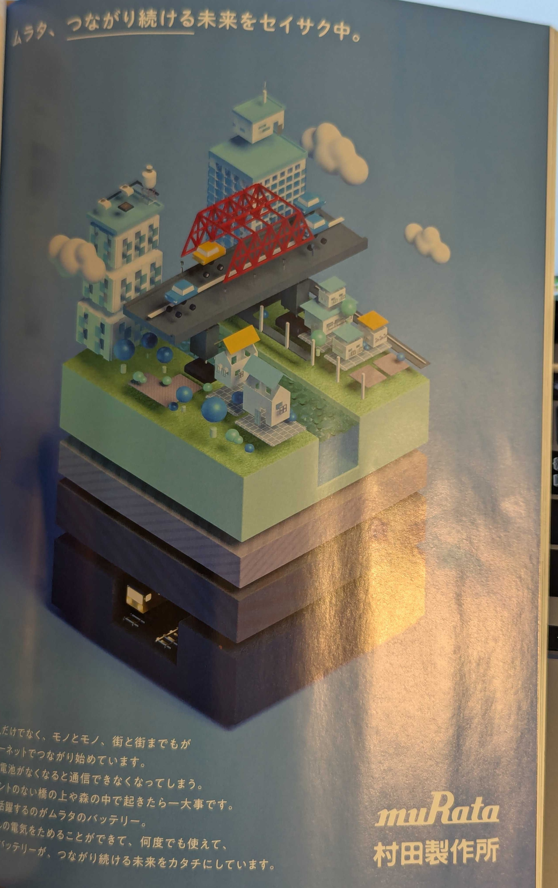
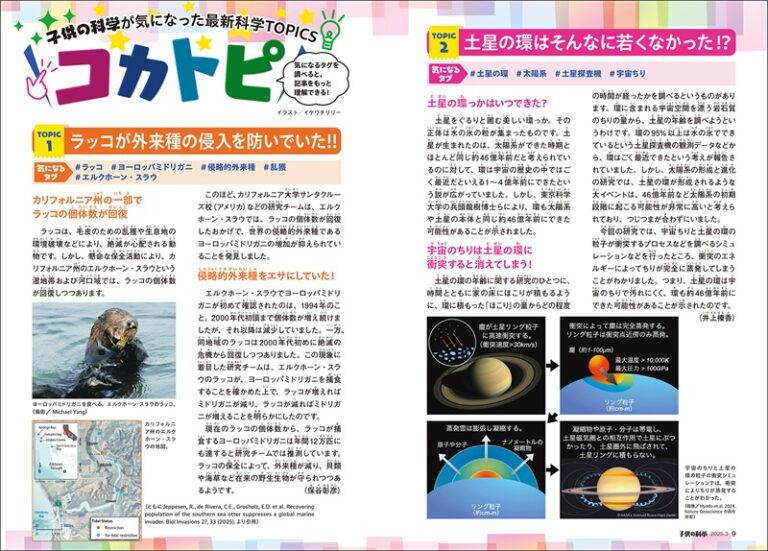
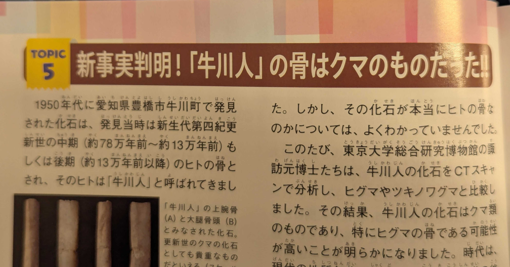
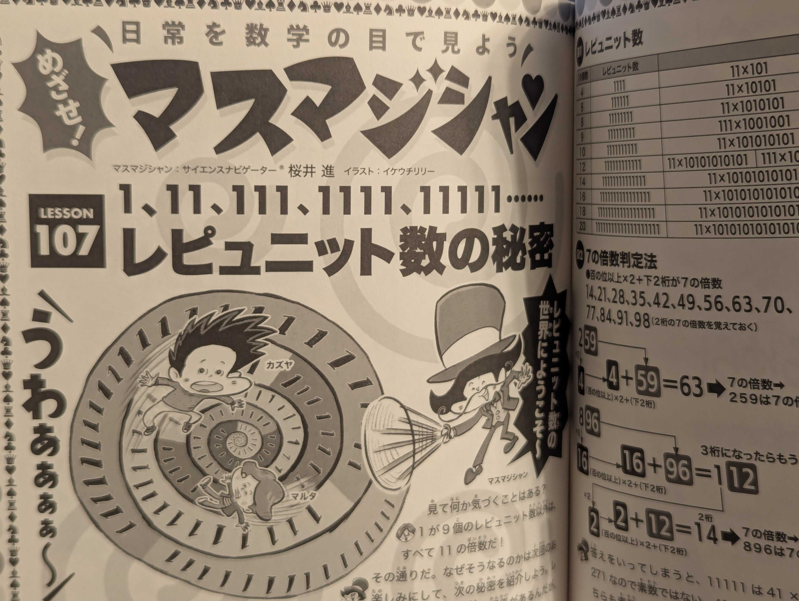
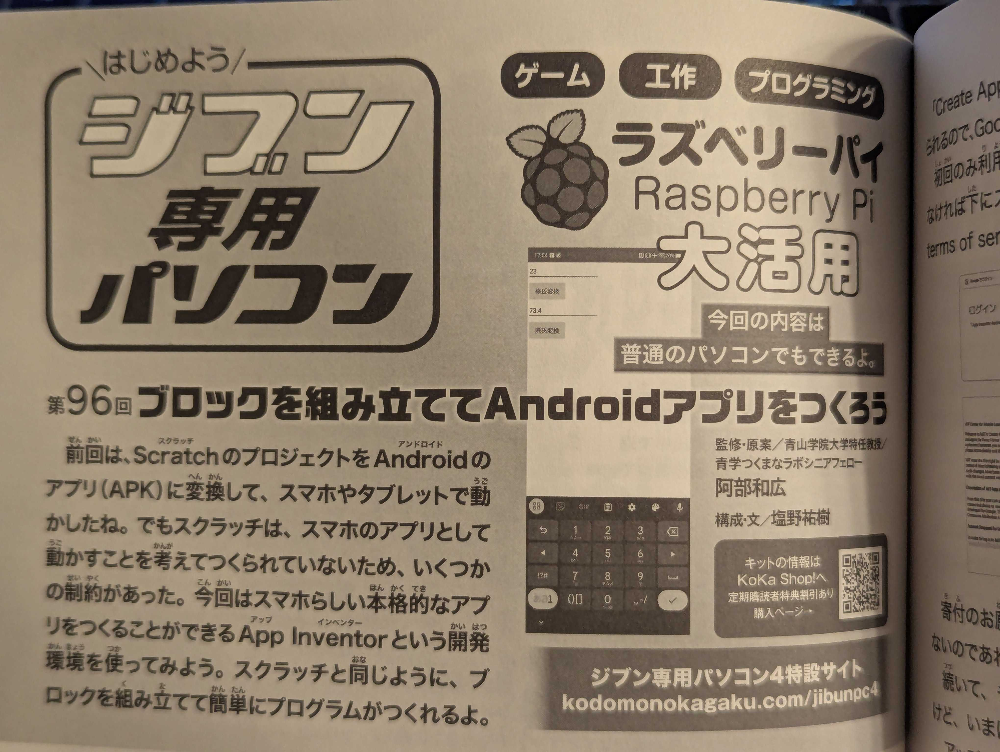
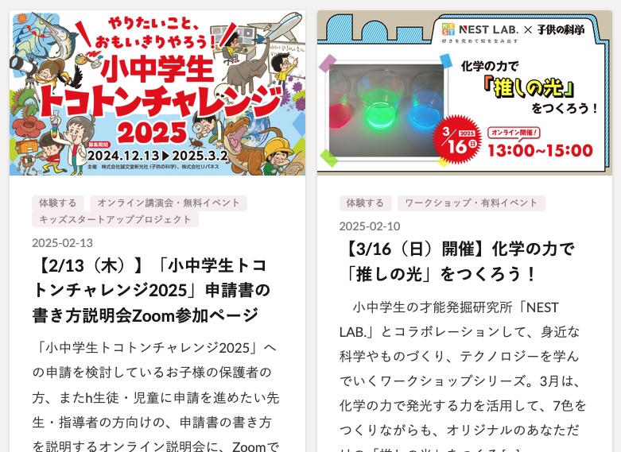
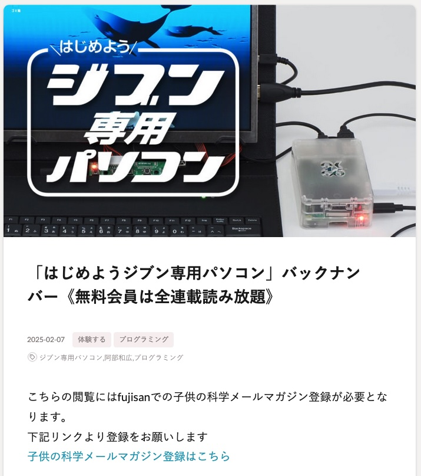
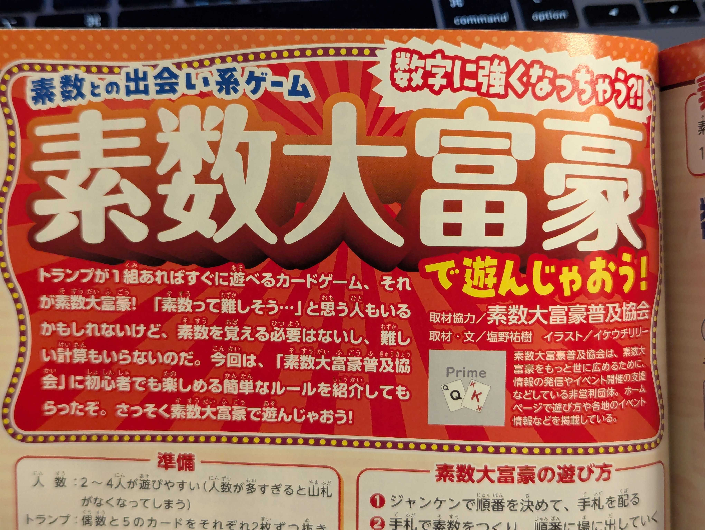

---
# You can also start simply with 'default'
theme: seriph
# random image from a curated Unsplash collection by Anthony
# like them? see https://unsplash.com/collections/94734566/slidev
background: https://cover.sli.dev
# some information about your slides (markdown enabled)
title: Welcome to Slidev
info: |
  ## Slidev Starter Template
  Presentation slides for developers.

  Learn more at [Sli.dev](https://sli.dev)
# apply unocss classes to the current slide
class: text-center
# https://sli.dev/features/drawing
drawings:
  persist: false
# slide transition: https://sli.dev/guide/animations.html#slide-transitions
transition: slide-left
# enable MDC Syntax: https://sli.dev/features/mdc
mdc: true
---

# 「子供の科学」がすごい

---
transition: fade-out
layout: two-cols
---

# 「子供の科学」

<v-clicks>

- 誠文堂新光社が刊行している子ども向け科学情報雑誌
- 小中学生向け
- 1924年(大正13年)創刊
- 関東大震災(大正12年)からの復興に必要な科学・技術を子どもたちに伝えるため

</v-clicks>

<v-click>

# 誠文堂新光社

</v-click>

<v-clicks>

- 「子供の科学」と同年に「MJ 無線と実験」、大正15年に「農耕と園芸」も刊行
- 近代以降の産業・文化の礎を築いたと言っても過言ではないかもしれない

</v-clicks>

::right::

---
transition: fade-out
layout: two-cols
---

# 広告がすごい

<v-clicks>

- 村田製作所
- 未来の技術者・研究者を育てるための出稿？

</v-clicks>

::right::

---
transition: fade-out
layout: two-cols
---

# ネタの幅が広い

<v-click>
科学全般(物理・化学・生物・地学・天文など)、数学と幅広い

 
</v-click>

::right::

<v-click>
<h1>　</h1>

 最近のトピックや、調査・研究が進んだことによる新説など、大人が読んでも学びがある

</v-click>

---
transition: fade-out
layout: two-cols
---
# 読みやすい
<v-clicks>

- 写真やイラストが豊富
- 本文の漢字全てにルビが振ってある

</v-clicks>

::right::

<h1>　</h1>
<h1>　</h1>
<v-click>

</v-click>

---
transition: fade-out
layout: two-cols
---

# 追加コンテンツ

### Zoomワークショップが開催されている

::right::

<h1>　</h1>

<v-click>

### 連載のバックナンバーが無料で閲覧可能

</v-click>

---
transition: fade-out
---

# こんな人におすすめ
## 小中学生のいるご家庭
<v-clicks>

- 子どもも大人も楽しく読んで学べる
- 興味を持った内容が自由研究の題材に
- 一緒に読んだり、遊んだりして親子間のコミュニケーションツールにも

</v-clicks>

<v-click>

</v-click>

